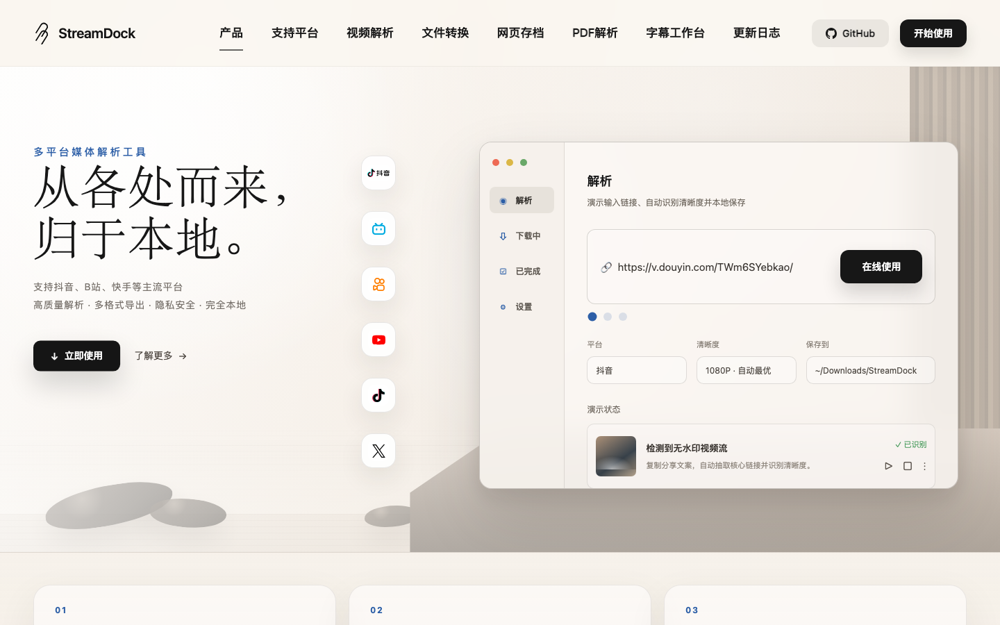
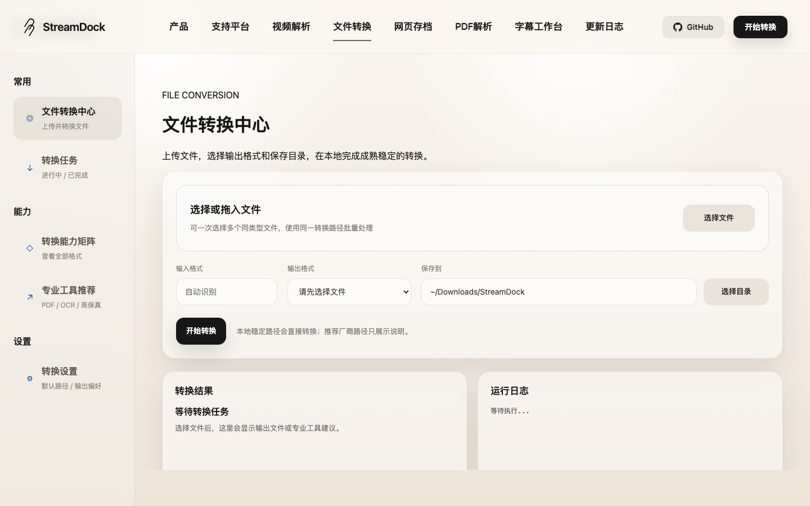
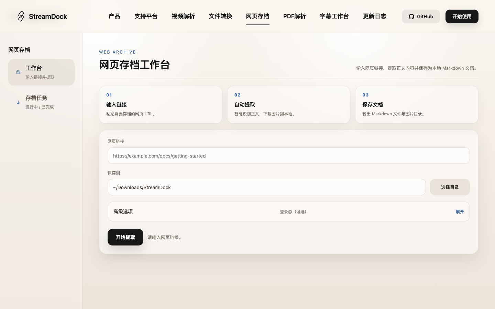
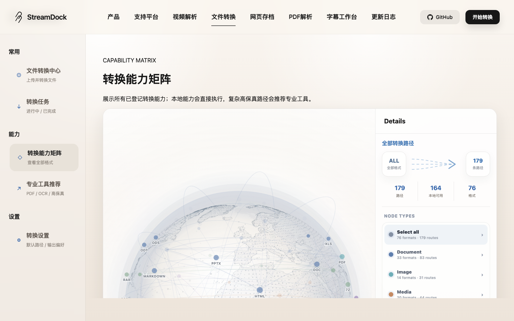
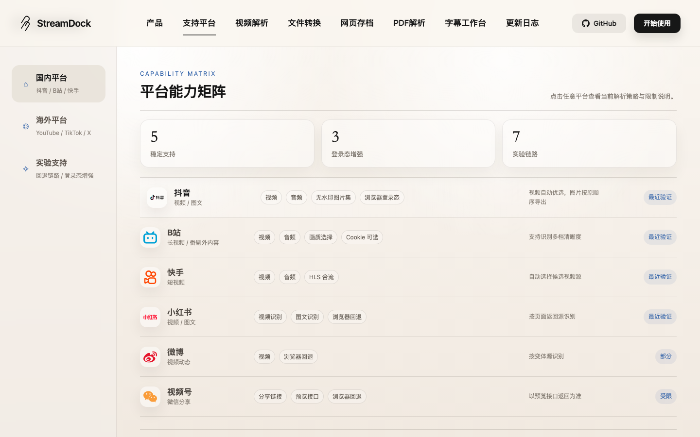

# StreamDock

StreamDock 是一个本地优先的媒体解析与文件处理工作台。它将多平台视频解析、文件格式转换、字幕处理、PDF 深度解析和异步任务管理集中在同一个 FastAPI Web 应用中，结果默认保存在用户指定的本地目录。

> 请仅处理你拥有或已获授权使用的内容，并遵守来源平台条款与当地法律。

## 项目界面

<p align="center">
  
</p>

<table>
  <tr>
    <td width="50%" align="center"><strong>文件转换中心</strong></td>
    <td width="50%" align="center"><strong>网页存档工作台</strong></td>
  </tr>
  <tr>
    <td></td>
    <td></td>
  </tr>
</table>

<table>
  <tr>
    <td width="50%" align="center"><strong>文件转换能力矩阵</strong></td>
    <td width="50%" align="center"><strong>平台解析能力</strong></td>
  </tr>
  <tr>
    <td></td>
    <td></td>
  </tr>
</table>

截图来自当前代码在本机 `1440 × 900` 视口下的实际运行页面。

## 功能概览

### 多平台媒体解析

- 统一处理链接识别、短链还原、作品信息提取、候选流分析、清晰度选择、下载和输出校验。
- 优先使用页面或接口中的结构化数据，失败时可回退到 Playwright 浏览器播放态。
- 支持视频、音频、图文作品、封面和原生字幕等资源；分离的音视频流通过 FFmpeg 合并。
- 视频文件校验完成后即可结束媒体任务，ASR/OCR 字幕识别在独立后台队列继续执行。

| 平台 | 设计/代码范围（非本部署验收结论） | 主要能力 |
| --- | --- | --- |
| 抖音 | 已实现·部署待验证 | 视频、图文作品、无水印图片集、浏览器登录态 |
| Bilibili | 已实现·部署待验证 | DASH、progressive `durl`、多档画质、音视频合并、可选 Cookie |
| 快手 | 已实现·部署待验证 | 视频候选源、HLS 下载与合并 |
| 小红书 | 受限·部署待验证 | 视频、图文识别、浏览器回退 |
| 微博 | 受限·部署待验证 | 视频变体识别、浏览器回退 |
| 视频号 | 受限·部署待验证 | 分享链接、预览接口、浏览器回退 |
| YouTube | 实验性 | 公开视频格式枚举、音视频合并 |
| TikTok | 实验性 | 公开分享页、候选源与浏览器回退 |
| X / Twitter | 实验性 | 推文视频变体与码率选择 |

平台返回结果受登录状态、内容权限、地区限制和页面结构变化影响。工具不会绕过账号本身无权访问的内容。

### 文件格式转换

- 当前能力矩阵登记了 **179 条去重转换路径、76 种格式**；其中 163 条为本地能力，16 条为专业工具建议。
- 成熟路径使用 Pillow、openpyxl、python-docx、FFmpeg 等本地引擎。
- Office 与开放文档格式可调用 LibreOffice；复杂排版、公式、批注和动画可能有损。
- 支持格式探测、目标格式校验、同格式批量任务、可编辑的待处理清单、批次历史恢复、超时控制和结果打开。
- 工作台可直接选择文件夹打包为 ZIP / TAR.GZ；在支持 File System Access API 的浏览器中会保留空目录。
- 已完成的视频任务可单独生成或重做字幕，编辑器会关联原视频与选中字幕轨，修订版可保存回原任务。
- 每个转换任务使用独立的输入/输出工作区；下载接口按任务 ID 读取带 SHA-256 清单的不可变产物，用户目录中的同名发布文件不会反向污染历史任务。
- 对暂不适合本地处理的复杂格式给出专业工具建议，而不是伪造转换结果。

<details>
<summary><strong>展开查看完整文件转换矩阵</strong></summary>

> `stable` 与 `basic` 共 163 条已登记本地路径；实际可用性仍取决于 FFmpeg、LibreOffice、PDF 引擎等运行时依赖。`vendor` 共 16 条，仅提供专业工具建议，不会生成伪造结果。

| 分类 | 转换路径 |
| --- | --- |
| 数据表格（23） | `csv → xlsx/json/tsv/txt`；`tsv → csv/xlsx/json`；`xlsx → csv/json/tsv`；`json → csv/xlsx/txt/yaml/xml/toml`；`txt → csv/xlsx`；`ndjson → json/csv`；`yaml/xml/toml → json` |
| 图片（28） | `png → jpg/webp/bmp/tiff/ico/ppm/gif`；`jpg → png/webp/bmp/tiff/ico`；`jpeg → png/webp`；`webp/bmp/tiff/ico/ppm → png/jpg`；`pgm/pbm/pnm → png`；`gif → png` |
| 音频（25） | `mp3 → wav/m4a/aac/flac/ogg/opus`；`wav → mp3/m4a/flac/ogg`；`m4a → mp3/wav/aac`；`aac/flac/aiff/wma/amr → mp3/wav`；`ogg/opus → mp3` |
| 视频（19） | `mp4 → mp3/wav/m4a/gif/webm`；`mov → mp4/gif/webm`；`mkv → mp4/webm`；`webm/avi/flv → mp4/gif`；`m4v/3gp/ts → mp4` |
| 字幕（7） | `srt ↔ vtt`；`ass → srt/vtt`；`txt → srt`；`lrc → srt/vtt` |
| 压缩包（14） | `zip/tar/tar.gz → folder` 及相互打包转换；`gz/bz2 → folder`；`folder → zip/tar.gz`；`7z/rar → folder/zip` |
| 轻文档（20） | `md/markdown → html/txt/docx/pdf`；`html → txt/md/docx/pdf`；`txt → html/md/docx/rtf/pdf`；`rtf → txt/html/docx` |
| Office 基础（20） | `docx → txt/html/md/rtf/pdf`；`doc/odt → docx/txt/html`；`ppt/odp → pptx`；`pptx → pdf`；`xls/ods → xlsx/csv`；`xlsx → pdf/html` |
| 电子书（4） | `epub → txt/html/md/pdf` |
| 矢量图文档（3） | `svg → png/jpg/pdf` |
| 专业工具建议（16） | `pptx → png`；`pdf → docx/xlsx/pptx`；`scan-pdf/image-ocr → docx/xlsx`；`complex-docx/complex-pptx → pdf`；`cad → pdf/png`；`psd → png`；`ai → pdf`；`sketch → figma`；`figma → pdf` |

</details>

### 字幕工作台

- 导入并解析 SRT、VTT 和 TXT。
- 在浏览器中编辑字幕时间轴与文本，并导出为 SRT、VTT 或 TXT。
- 媒体解析按“平台原生字幕 → ASR → 画面 OCR”顺序补充字幕。
- ASR/OCR 失败不会覆盖已经成功下载的视频结果。

### PDF 深度解析

- 分析文本层、图片比例和页面特征，推荐自动、文本或 OCR 策略。
- 使用独立的 MinerU 环境执行深度解析，避免与主程序依赖冲突。
- 通过异步任务展示进度、结构化 Markdown、结果文件和归档状态。
- MinerU 不可用时会通过健康检查给出明确提示，不影响其他工作台使用。

### 网页存档

- 通过 Crawl4AI 渲染网页并提取完整 Markdown，保留标题、正文、表格、代码块和 Unicode 内容。
- 将页面图片下载到本地并重写 Markdown 链接，形成可离线阅读的存档目录。
- 可选传入用户授权的 Cookie 处理需要登录的页面，任务过程在本地队列中执行。

### 任务与运行状态

- 媒体、字幕、文件转换和 PDF 任务统一进入本地任务中心。
- 支持查看详情、重试、删除、清理已完成任务，以及暂停和恢复媒体等待队列。
- 生产环境使用 SQLite WAL 与事务持久化任务状态；服务异常退出后会标记未完成的后台工作，并避免并发更新互相覆盖。
- 错误目录提供结构化错误码、可重试状态和建议操作。
- 环境检查覆盖 Python、FFmpeg/FFprobe、Playwright、ASR、OCR、PDF 引擎和输出目录。

## 快速开始

StreamDock 的推荐部署方式是：**在需要使用它的电脑上安装并运行，然后通过本机浏览器访问**。默认只监听 `127.0.0.1`，不会向局域网或公网开放；用户选择的文件、输出目录、浏览器登录态和任务历史也都属于当前电脑。

### 环境要求

- Python 3.11+
- FFmpeg 和 FFprobe
- Git
- macOS、Linux 或 Windows（项目当前主要在 macOS 环境验证）
- 至少预留数 GB 磁盘空间；浏览器、ASR 和 PDF 模型会占用额外空间

安装后先确认基础命令可用：

```bash
python --version
ffmpeg -version
ffprobe -version
git --version
```

如果系统使用 `python3` 命令，请将后续示例中的 `python` 替换为 `python3`。

#### macOS

```bash
brew install python@3.11 ffmpeg
python3.11 --version
```

#### Ubuntu / Debian

```bash
sudo apt update
sudo apt install -y git python3 python3-venv python3-pip ffmpeg
python3 --version
```

如果系统自带 Python 低于 3.11，请先通过系统软件源、pyenv 或 Conda 安装 Python 3.11，再继续创建环境。

#### Windows

可以通过 winget 安装 Git、Python 3.11 和 FFmpeg：

```powershell
winget install --id Git.Git
winget install --id Python.Python.3.11
winget install --id Gyan.FFmpeg
```

安装后重新打开 PowerShell，并确认 `python`、`ffmpeg` 和 `ffprobe` 已加入 `PATH`。

### 拉取代码

```bash
git clone https://github.com/lkxdsb/stream-dock.git
cd stream-dock
```

### 创建 Python 环境

macOS / Linux：

```bash
# macOS Homebrew 可使用 python3.11；Linux 使用已确认版本不低于 3.11 的 python3
python3.11 -m venv .venv
source .venv/bin/activate

python -m pip install --upgrade pip
python -m pip install -r requirements.txt
```

如需在平台没有原生字幕时启用本地 ASR，再安装媒体可选依赖：

```bash
python -m pip install -r requirements-media.txt
```

Linux 如果命令名是 `python3`：

```bash
python3 -m venv .venv
source .venv/bin/activate
python -m pip install --upgrade pip
python -m pip install -r requirements.txt
```

Windows PowerShell：

```powershell
py -3.11 -m venv .venv
.\.venv\Scripts\Activate.ps1

python -m pip install --upgrade pip
python -m pip install -r requirements.txt
```

如果 PowerShell 禁止执行激活脚本，也可以不激活环境，直接使用：

```powershell
.\.venv\Scripts\python.exe -m pip install -r requirements.txt
```

也可以使用 Conda：

```bash
conda create -n streamdock python=3.11 -y
conda activate streamdock
python -m pip install -r requirements.txt
```

### 安装浏览器解析组件

Playwright 用于抖音等平台的浏览器回退链路，建议安装：

```bash
python -m playwright install chromium
```

Ubuntu / Debian 如果提示缺少 Chromium 系统依赖：

```bash
python -m playwright install --with-deps chromium
```

### 启动

macOS / Linux：

```bash
python -m uvicorn app:app --host 127.0.0.1 --port 8002
```

Windows PowerShell：

```powershell
python -m uvicorn app:app --host 127.0.0.1 --port 8002
```

如果没有激活 Windows 虚拟环境：

```powershell
.\.venv\Scripts\python.exe -m uvicorn app:app --host 127.0.0.1 --port 8002
```

打开 <http://127.0.0.1:8002>。终端需要在使用期间保持运行，按 `Ctrl+C` 停止服务。

macOS 用户如果使用名为 `jj` 的 Conda 环境，也可以双击 `start_streamdock.command`。该脚本是 macOS 专用启动器，不适用于 Windows 或普通 Linux 桌面。

### 验证安装

打开健康检查页面：

<http://127.0.0.1:8002/api/health>

或者在另一个终端中执行：

```bash
curl http://127.0.0.1:8002/api/health
curl 'http://127.0.0.1:8002/api/health/ready?outputPath=~/Downloads/StreamDock'
```

页面会分别显示 Python、FFmpeg/FFprobe、Playwright、图片/表格转换、ASR、OCR、PDF 引擎和输出目录状态。核心依赖正常后即可使用；可选能力缺失不会阻止其他工作台启动。

### 服务器模式（M9）

默认 `desktop` 模式仅供本机使用。如需通过反向代理或局域网提供服务，必须显式启用服务器模式，并同时配置访问令牌、Host/Origin 白名单和专用输出根目录：

```bash
export STREAMDOCK_MODE=server
export STREAMDOCK_API_TOKEN="$(python -c 'import secrets; print(secrets.token_urlsafe(32))')"
export STREAMDOCK_TRUSTED_HOSTS=streamdock.example.com
export STREAMDOCK_ALLOWED_ORIGINS=https://streamdock.example.com
export STREAMDOCK_SERVER_OUTPUT_ROOT=/srv/streamdock/output
export STREAMDOCK_BUILD_VERSION="$(git rev-parse --short HEAD)"
python -m uvicorn app:app --host 0.0.0.0 --port 8002
```

启动后先访问 `/auth` 建立 HttpOnly 会话；自动化客户端可使用 `Authorization: Bearer <token>`。服务器模式下：

- 缺少任一必需配置时启动失败，仅 liveness 语义可报告未配置状态；
- 拒绝未信任的 `Host` 和 `Origin`，令牌不进入 URL；
- 禁用 Finder/系统选择器/本机打开文件 API；
- 所有任务输出必须位于 `STREAMDOCK_SERVER_OUTPUT_ROOT` 内，用户通过 task-scoped 下载接口取得产物。

`STREAMDOCK_ALLOW_LAN_API=1` 会被视为服务器模式，不再允许无认证的 LAN 暴露。当前是单信任用户部署边界，不是多租户账号系统。生产环境请在 TLS 反向代理后运行，并设置 `STREAMDOCK_SECURE_COOKIE=1`。

### 媒体解析运行时与部署诊断

- `STREAMDOCK_BROWSER_MODE=auto`（默认）先使用 Playwright 自带 Chromium，**只有启动失败**才尝试系统 Chrome；也可设为 `chromium`、`chrome` 或 `disabled`。不在请求期间安装浏览器。`STREAMDOCK_BROWSER_LAUNCH_TIMEOUT_MS=10000` 与 `STREAMDOCK_BROWSER_CONCURRENCY=2` 控制启动及并发；缺少浏览器不影响纯 HTTP 解析或文件转换。
- `/api/health/ready` 只读取浏览器检查缓存，未主动检查时显示 `unchecked`。在页面“重新检查”或调用 `POST /api/health/browser/refresh` 后，服务账号会实际启动浏览器并执行本地 JavaScript/DOM 检查，结果缓存 5 分钟。此检查**不证明**媒体平台可访问。
- `GET /api/media/auth` 只返回六个平台的配置状态；`PUT/DELETE /api/media/auth/{platform}` 粘贴导入或撤销 Cookie，`POST /api/media/auth/{platform}/import` 可上传单行 Cookie Header、Netscape Cookie 文件或不含 localStorage 的 Playwright Cookie 状态。文件只接受所选平台域名的根路径 Cookie；不导入完整浏览器档案。`POST /api/media/auth/{platform}/verify` 每平台每分钟至多一次，目前仅 B站能作登录态专用验证，其余平台返回 `unknown`，不能将导入成功标为有效。服务器导入凭据要求 HTTPS；应用会话令牌与媒体平台授权互不替代。默认仅当前服务进程内存保存授权，重启失效。
- 登录态验证结论默认仅在 60 分钟内作为“最近确认”，超时显示 `unknown`（可用 `STREAMDOCK_AUTH_VERIFICATION_TTL_MINUTES` 调整）；它不是账号持续有效的保证。
- 桌面模式也不会默认读取日常浏览器档案。若明确要复用本机 B站/抖音的浏览器 Cookie，才设置 `STREAMDOCK_ALLOW_DESKTOP_BROWSER_COOKIES=1`；服务器模式始终忽略该开关，优先使用受控平台授权配置。
- 若确需重启保留授权，请分别配置 `STREAMDOCK_MEDIA_AUTH_KEY`（Fernet 密钥，可由 `python -c 'from cryptography.fernet import Fernet; print(Fernet.generate_key().decode())'` 生成）与 `STREAMDOCK_MEDIA_AUTH_STORE`（仅服务账号可读的密文文件），并在导入时选择保存。密钥不要与密文文件放在同一位置。当前授权存储是进程内状态加可选密文快照，**必须以单 worker 运行**；多 worker 共享/并发更新尚未实现。
- `POST /api/media/diagnostics` 接受 1–10 条链接，`GET /api/media/diagnostics/{id}` 查询诊断结果；诊断复用任务中心，任务记录只保存输入哈希、授权配置 ID/版本、阶段与结果，不保存原始链接或授权原文。默认只解析并读取至多 1 KiB 媒体前缀；解析子进程受 `STREAMDOCK_MEDIA_PROBE_TIMEOUT_MS=90000` 总预算约束。显式传 `fullDownload=true` 时每次至多 2 条，选定的视频/分离音轨下载到临时目录，按单文件默认 64 MiB（`STREAMDOCK_DIAGNOSTIC_MAX_BYTES`，硬上限 256 MiB）、180 秒预算执行 FFprobe、FFmpeg 全程解码与视频抽帧；图文逐张下载并解码，结束后均清理临时文件。诊断可通过 `DELETE /api/tasks/{id}` 取消；yt-dlp 虚拟地址不在完整下载诊断范围。重启时未完成诊断标记中断，已完成摘要仍可查询。建议部署时设置 `STREAMDOCK_BUILD_VERSION` 为实际提交号，便于结果对照。
- 服务器上线后，先用原 60 条链接复测三轮，再准备当前可播放正向样本、按平台验证授权与下载质量。`resourceSampled` 只表示前缀可读；必须通过服务器实际交付文件的完整 FFprobe/FFmpeg 解码和内容抽帧，才能标记完整质量通过。浏览器组件恢复不能直接说明六个平台已恢复。
- 平台直接声明的文件大小会标为 `platform-declared`，不会用于“最小体积”推荐；`range-verified` 才代表有界资源请求核实了总长度。平台页的“近期交付格式可解析”只对应已交付产物的结构检查，不等于全片解码或稳定性通过。

### 可选依赖

| 能力 | 依赖 |
| --- | --- |
| Office / OpenDocument 转换 | LibreOffice |
| 语音字幕 | `faster-whisper`、OpenAI Whisper 或 Whisper CLI |
| 画面字幕 OCR | Tesseract OCR、FFmpeg |
| PDF 深度解析 | 独立 MinerU 环境 |

macOS 可安装 OCR 与 Office 转换依赖：

```bash
brew install tesseract tesseract-lang
brew install --cask libreoffice
```

Ubuntu / Debian：

```bash
sudo apt install -y tesseract-ocr tesseract-ocr-chi-sim libreoffice
```

PDF 环境安装脚本需要 Bash 和 Conda，适用于 macOS/Linux：

```bash
bash scripts/setup_mineru_env.sh
```

Windows 用户可以通过 WSL 使用该脚本，或自行安装 MinerU 后通过 `STREAMDOCK_MINERU_EXECUTABLE` 指定可执行文件。PDF 深度解析是可选能力，不影响媒体解析、格式转换和字幕工作台。

首次执行深度解析时可能下载模型。模型文件不应提交到 Git 仓库，相关第三方许可见 [`THIRD_PARTY_NOTICES.md`](THIRD_PARTY_NOTICES.md)。

### 本机数据位置

- 任务历史默认保存在用户目录下的 `.streamdock/tasks.sqlite3`；首次升级会备份并迁移旧的 `tasks.json`。
- PDF 临时输入默认保存在 `.streamdock/pdf-inputs/`。
- 媒体、转换和 PDF 结果保存在页面中选择的本机输出目录。
- 平台登录态仅来自主动导入的 Cookie；桌面模式显式开启 `STREAMDOCK_ALLOW_DESKTOP_BROWSER_COOKIES=1` 时才会读取本机浏览器 Cookie，不会从其他设备自动同步。
- 不要把 Cookie、下载结果、模型文件或 `.streamdock` 数据提交到 Git。

## 页面入口

| 地址 | 功能 |
| --- | --- |
| `/` | 产品首页与运行环境概览 |
| `/use` | 媒体链接解析与下载 |
| `/platforms` | 平台能力、限制和运行状态 |
| `/convert` | 文件转换、批量任务和能力矩阵 |
| `/web-archive` | 网页正文、表格、代码和图片本地存档 |
| `/subtitles` | 字幕导入、编辑与导出 |
| `/pdf` | PDF 分析和深度解析 |
| `/updates` | 产品更新记录 |
| `/about` | 项目说明 |

存活接口（无文件或外部进程副作用）：<http://127.0.0.1:8002/api/health>

完整就绪检查：<http://127.0.0.1:8002/api/health/ready>

转换发布门禁状态：<http://127.0.0.1:8002/api/convert/release-status>

## 常用配置

| 环境变量 | 用途 |
| --- | --- |
| `STREAMDOCK_PORT` | `start_streamdock.command` 使用的监听端口，默认 `8002` |
| `STREAMDOCK_TASK_STORAGE_PATH` | 自定义任务状态存储路径 |
| `STREAMDOCK_ARTIFACT_ROOT` | 自定义转换任务工作区与产物清单目录（默认 `~/.streamdock/artifacts`） |
| `STREAMDOCK_MAX_API_REQUEST_BYTES` | API 请求体声明大小上限，默认 1 GiB；反向代理仍应配置对应限制 |
| `STREAMDOCK_MAX_ARCHIVE_EXTRACTED_BYTES` | 压缩包最大展开字节数，默认 2 GiB |
| `STREAMDOCK_MAX_IMAGE_PIXELS` / `STREAMDOCK_MAX_IMAGE_FRAMES` | 图片像素和动画帧预算 |
| `STREAMDOCK_MAX_REMOTE_DOWNLOAD_BYTES` | 单个媒体直链最大下载字节数，默认 2 GiB |
| `STREAMDOCK_MAX_ASSET_DOWNLOAD_BYTES` | 字幕、封面和图集单项资源上限，默认 256 MiB |
| `STREAMDOCK_MAX_COMPARISON_INPUT_BYTES` | 转换前后对比最大读取文件大小，默认 16 MiB |
| `STREAMDOCK_MINERU_EXECUTABLE` | 指定 MinerU 可执行文件 |
| `STREAMDOCK_SUBTITLE_ASR_MODEL` | 指定 ASR 模型，默认 `base` |
| `STREAMDOCK_SUBTITLE_ASR_DEVICE` | 指定 ASR 设备，默认 `cpu` |
| `STREAMDOCK_SUBTITLE_ASR_LANG` | 指定 ASR 语言，默认 `zh` |
| `STREAMDOCK_SUBTITLE_OCR_LANG` | 指定 Tesseract 语言，默认 `chi_sim+eng` |
| `BILIBILI_COOKIE` | 手动提供 Bilibili Cookie |
| `BILIBILI_COOKIE_FILE` | 从本地文件读取 Bilibili Cookie |

Cookie 仅应通过本机环境或未跟踪文件提供，不要写入源码、日志、Issue 或提交记录。

## 测试

CI 使用 Python 3.11 生成的 `requirements-lock-py311.txt`，避免开发机上的框架和工具版本漂移。准备一致的测试环境可执行：

```bash
python3.11 -m venv .venv-test
source .venv-test/bin/activate
python -m pip install -r requirements-lock-py311.txt
python -m pip check
```

运行完整回归测试：

```bash
conda run -n jj python -m unittest discover -s tests -v
```

也可以在已经安装 pytest 的开发环境中运行：

```bash
conda run -n jj python -m pytest -q
```

检查前端脚本和 Git diff：

```bash
for file in static/js/*.js; do node --check "$file"; done
git diff --check
```

文件转换不能只跑单元测试；还必须执行真实文件黄金样例、随机模糊测试和全路径矩阵：

```bash
python scripts/test_conversion_robustness.py
python scripts/test_conversion_fuzz.py --iterations 100
python scripts/test_conversion_matrix_real.py
python scripts/fetch_complex_conversion_corpus.py
python scripts/test_conversion_complex_corpus.py
python scripts/verify_conversion_release.py
python scripts/test_frontend_m5_browser.py
python scripts/test_frontend_m6_browser.py
python scripts/test_frontend_m8_browser.py
python scripts/test_frontend_m9_browser.py
```

具体内容级断言和降级策略见 [`docs/CONVERSION_QUALITY_VALIDATION.md`](docs/CONVERSION_QUALITY_VALIDATION.md)。

## 项目结构

```text
stream-dock/
├── app.py                 # FastAPI 页面、API 与任务编排
├── fetchers/
│   ├── adapters/          # 各平台链接规范化与媒体信息提取
│   ├── pipeline.py        # 统一探测、下载、导出与字幕策略
│   └── downloader.py      # 直链、HLS 与 yt-dlp 下载
├── converters/
│   ├── adapters/          # 文档、图片、媒体、字幕和归档转换器
│   ├── registry.py        # 转换能力矩阵
│   └── pipeline.py        # 转换探测与执行
├── subtitles/             # 字幕解析、校验和导出
├── pdf_engine/            # PDF 分析、策略、质量评估与 MinerU 适配
├── web_archive/          # 网页渲染、Markdown 提取、图片本地化与任务队列
├── tasks/                 # 媒体、字幕、转换、PDF 队列与状态存储
├── templates/             # Jinja2 页面模板
├── static/                # 样式、交互脚本和图标
├── runtime_checks.py      # 环境、代理、输出和媒体质量检查
├── tests/                 # 单元、API、任务与平台回归测试
└── scripts/               # 环境安装、鲁棒性测试和构建脚本
```

核心媒体流程：

```text
输入链接
  → 平台识别与链接规范化
  → 结构化信息提取
  → 浏览器回退（按需）
  → 媒体候选与清晰度选择
  → 下载 / FFmpeg 合并
  → 输出质量检查
  → 后台字幕任务（按需）
```

## 隐私与安全

- 服务默认仅监听 `127.0.0.1`，API 默认拒绝非本机来源。
- 上传文件、转换结果和任务结果保存在本地，不需要上传到 StreamDock 服务器。
- 上传大小、批量数量、任务超时、磁盘空间、输出目录和临时文件均有边界控制。
- 浏览器登录态只用于用户主动授权的平台解析，不会提升账号本身权限。
- `.gitignore` 已排除常见 Cookie、日志、输出目录、缓存和临时下载文件；发布前仍应人工检查。

## 当前边界

- 平台页面、接口和风控策略会变化，实验性平台不保证长期稳定。
- 受登录、会员、地区、版权、作者设置或下架状态限制的内容可能无法解析。
- 本地格式转换以可验证结果为目标，不承诺复杂排版和专有格式的完全保真。
- ASR、OCR 和 PDF 模型会占用额外磁盘、内存和处理时间。

## License

项目当前尚未添加统一的开源许可证。在明确许可证之前，仓库公开可见不代表自动授予复制、修改或再分发权限。
